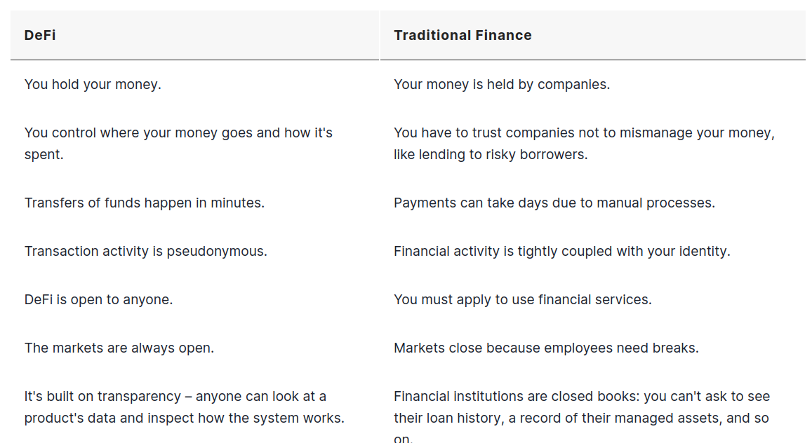

# Abstract
- Defi is a open and global financial system built for the internet age
- An alternative to existing solutions
- It gives you control and visibility over your money
- It gives exposure to global markets and alternatives to your local currency or banking options
- Defi products open up financial services to anyone in the internet 
# Meaning of DeFi
- Collective term for financial products and services that are acessibe to anyone who can use Ethereum
- Market is always open and there is no central authority to block operations
- Services that previously were slow and at risk of human error now are simply automatic and safer because it becomes handled by the code
# DeFi vs Traditional Finance
## Traditional Finance Problems
- Some people dont have access to financial services
- Lack of access to financial services can prevent people of getting employed
- Financial Services can block you from getting paid
- The necessity of these financial institutions gather your data
- Central authorities can close out service at their own will
- Trading hours are limited
- Money transfers can take days because of internal processes
- Cost derived by intermedium chains to deliver financial services
## Comparation

# Stable-coins
- Tokens that maintain an very approached value in comparation with fiat currencies
## How does it work?
- It is either backed by fiat, precious metal or even algorithms which results in their value be very much alike the fiat currency (parity)
### Types of stable coins
#### Fiat Backed
- People use their fiat cash (like dolar) and trade it by a certain stable coin
- People can redeem it back to the original cryptocurrency depending of the given reservs

|Pros|Const|
|--|--|
|Changes in price are minimal|It is centralized because someone must send tokens|
|Changes in price are minimal|Requires auditing, to ensure there are a certain level of fixed reserves|
##### Projects
- USDC
- TrueUSD
#### Crypto Backed
- This kind of backing is made by a cryptocurrency like eth
- In order to a cryptocurrency to back such thing, the value of the cryptocurrency used to back it up must have atleast 2$ for each 1$